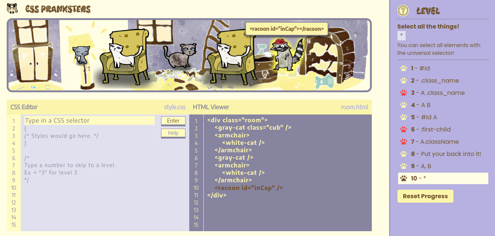

# CSS-selectors
game for learning selectors in CSS.
*********
Deploy: https://fileofish-css-selectors.netlify.app/
*********
Technology stack: 
- TypeScript
- Modules - classes
- SCSS
- Webpack
- ESLint
- Jest
*********
Description: 
- The task of the game is to select active selectors in the HTML Viewer. Selectors are presented in the form of animals, active animals are animated.
- When you hover over an animal or selector in the HTML Viewer, the animal and the corresponding selector will be highlighted, and a hint will appear next to the animal indicating the appropriate selector.
- The selector must be written to a line in the "CSS Editor" field, after which the user must press the Enter button (or the Enter key on the keyboard).
- If the answer turns out to be correct, you will go to the next level. In case of passing all levels, a congratulatory window will appear.
- If the answer turns out to be incorrect, the animation of the code block twitching will work.
- If you do not know the correct answer, you can use the hint by clicking on the Help button in the "CSS Editor", in this case the icon in the row of the completed level will turn red.
- A description of the current level is available to the user if you click on the question mark icon in the "Level Bar".
- The user can also reset the progress of completed levels by clicking on the "Reset Progress" button located in the "Level Bar".
- The user has the opportunity to go to the completed levels and consolidate the knowledge gained by selecting the appropriate level in the "Level Bar" or by entering the required level in the input "CSS Editor".
- If the game tab is closed or reloaded, the progress is saved in localStorage.
*********

